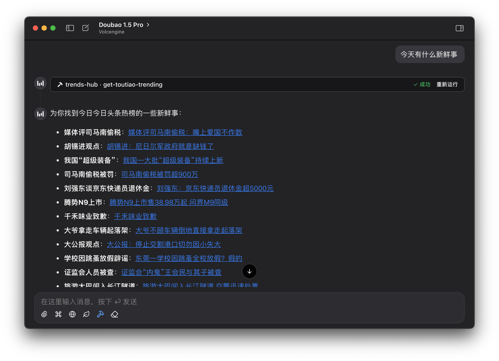

# 🔥 Trends Hub

[](https://www.npmjs.com/package/mcp-trends-hub)


基于 Model Context Protocol (MCP) 协议的全网热点趋势一站式聚合服务

## 使用方法

```jsonc
{
  "mcpServers": {
    "trends-hub": {
      "command": "npx",
      "args": ["-y", "mcp-trends-hub@latest"]
    }
  }
}
```

## 工具列表

| 工具名称                  | 描述               |
| ------------------------- | ------------------ |
| get-36kr-trending         | 获取 36 氪热榜     |
| get-bilibili-rank         | 获取哔哩哔哩排行榜 |
| get-douban-rank           | 获取豆瓣实时热门榜 |
| get-douyin-trending       | 获取抖音热榜       |
| get-ifanr-news            | 获取爱范儿快讯     |
| get-juejin-article-rank   | 获取掘金文章榜     |
| get-smzdm-rank            | 获取什么值得买热门 |
| get-sspai-rank            | 获取少数派热榜     |
| get-tencent-news-trending | 获取腾讯新闻热点榜 |
| get-thepaper-trending     | 获取澎湃新闻热榜   |
| get-toutiao-trending      | 获取今日头条热榜   |
| get-weibo-trending        | 获取微博热搜榜     |
| get-zhihu-trending        | 获取知乎热榜       |

更多工具正在开发中，欢迎提交 PR 或 Issue。

## 示例



## 鸣谢

- [DailyHotApi](https://github.com/imsyy/DailyHotApi) - 部分工具的实现参考
