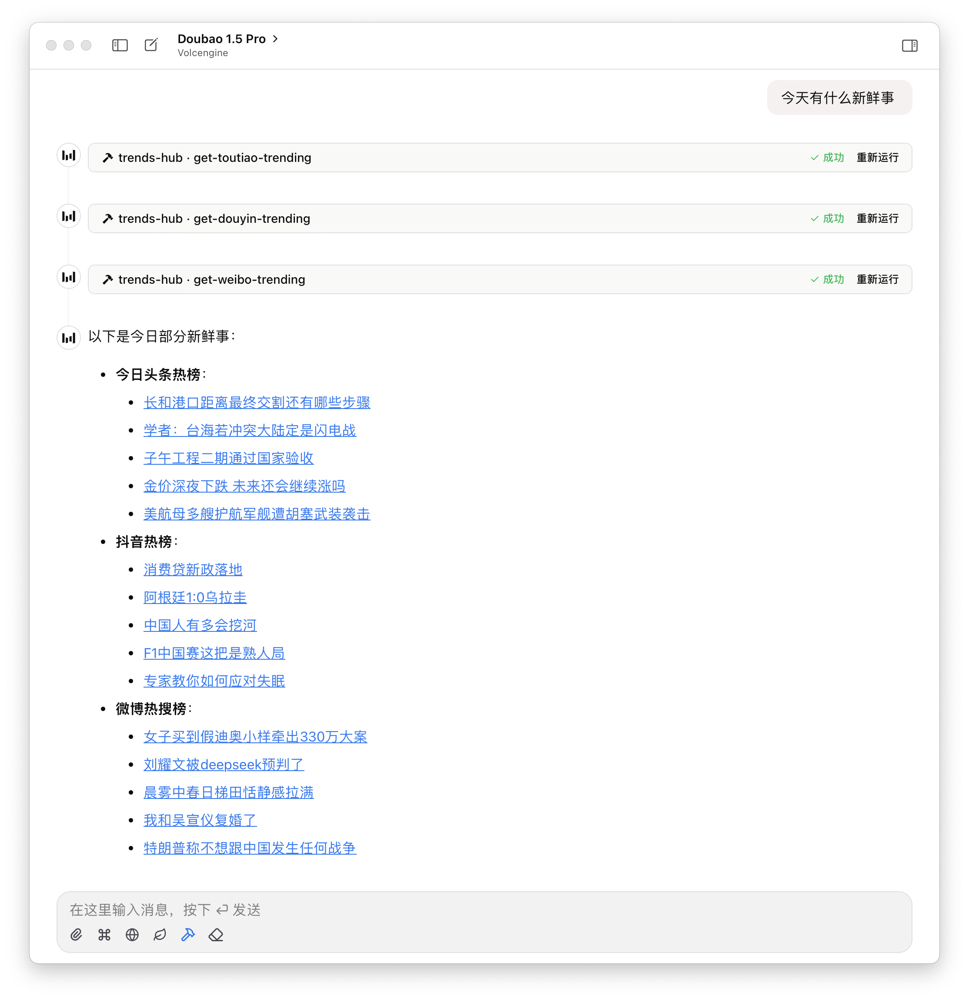

# 🔥 Trends Hub

[](https://www.npmjs.com/package/mcp-trends-hub)


基于 Model Context Protocol (MCP) 协议的全网热点趋势一站式聚合服务

## 使用方法

<!-- usage-start -->
```json
{
  "mcpServers": {
    "trends-hub": {
      "command": "npx",
      "args": [
        "-y",
        "mcp-trends-hub@1.4.0"
      ]
    }
  }
}
```

<!-- usage-end -->
### 支持的环境变量

- `TRENDS_HUB_HIDDEN_FIELDS` - 隐藏的字段列表，逗号分隔
  - 作用于所有工具：`{field-name}`，例如 `cover`
  - 作用于特定工具：`{tool-name}:{field-name}`，例如 `get-toutiao-trending:cover`

## 工具列表

<!-- tools-start -->
| 工具名称 | 描述 |
| --- | --- |
| get-36kr-trending | 获取 36 氪热榜 |
| get-9to5mac-news | 获取 9to5mac 新闻 |
| get-bilibili-rank | 获取哔哩哔哩排行榜 |
| get-douban-rank | 获取豆瓣实时热门榜 |
| get-douyin-trending | 获取抖音热榜 |
| get-gcores-new | 获取机核新闻 |
| get-ifanr-news | 获取爱范儿快讯 |
| get-infoq-news | 获取 InfoQ 新闻 |
| get-juejin-article-rank | 获取掘金文章榜 |
| get-netease-news-trending | 获取网易新闻热点榜 |
| get-nytimes-news | 获取纽约时报新闻 |
| get-smzdm-rank | 获取什么值得买热门 |
| get-sspai-rank | 获取少数派热榜 |
| get-tencent-news-trending | 获取腾讯新闻热点榜 |
| get-thepaper-trending | 获取澎湃新闻热榜 |
| get-theverge-news | 获取 The Verge 新闻 |
| get-toutiao-trending | 获取今日头条热榜 |
| get-weibo-trending | 获取微博热搜榜 |
| get-weread-rank | 获取微信读书排行榜 |
| get-zhihu-trending | 获取知乎热榜 |


<!-- tools-end -->

更多工具正在开发中，欢迎提交 PR 或 Issue。

## 示例

<picture>
  <source media="(prefers-color-scheme: dark)" srcset="./assets/cace-drak.png">
  
</picture>


## 鸣谢

- [DailyHotApi](https://github.com/imsyy/DailyHotApi) - 部分工具的实现参考
